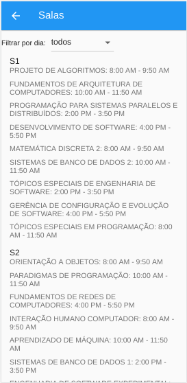

# Greed_novasSalasESW

**Número da Lista**: 4 
**Conteúdo da Disciplina**: Algoritmos Ambiciosos 

## Alunos
|Matrícula | Aluno |
| -- | -- |
| 14/0158278  |  Pedro Helias Carlos |
| 17/0069991	 |  João Victor Max Bisinotti de Oliveira |

## Vídeo de Apresentação

## Sobre

A ideia do projeto é a seguinte: Devido a grande popularidade do curso de Engenharia de Software, a FGA decidiu construir um novo prédio, exclusivo para o curso. Para tal, solicitou nossa ajuda para saber a quantidade de salas de aula necessárias para comportar todas as turmas. 
No projeto, consideramos uma turma de cada disciplina e utilizamos o algoritmo ambicioso Interval Partitioning para alocar as turmas às novas salas. 

## Screenshots

## Instalação
**Linguagem**: Dart 
**Framework**: Flutter 

1. Instale o Flutter em seu computador seguindo os passos descritos na documentação oficial: https://flutter.dev/docs/get-started/install
2. Clone o repositório do projeto em sua máquina
3. Execute o comando `flutter pub get` no diretório raiz do projeto para instalar as dependências necessárias
4. Conecte seu dispositivo móvel ao computador ou inicie um emulador de dispositivo móvel ou selecione o navegador(Chrome(web)) como Flutter Device.
5. Execute o comando `flutter run` no diretório raiz do projeto para iniciar o aplicativo

## Uso
A tela inicial mostra a lista das disciplinas de Engenharia de Software, foi cadastrada uma turma de cada disciplina e seus respectivos horários de início e término, além dos dias da semana em que ela ocorre. Nessa tela é possível filtrar a lista por dia da semana.
O botão 'check' no canto superior direito da tela(na app bar) executa o algoritmo Interval Partitioning e faz a navegação para uma nova tela, que mostra as salas e suas turmas. Nessa tela também é possível realizar a filtragem por dia da semana.